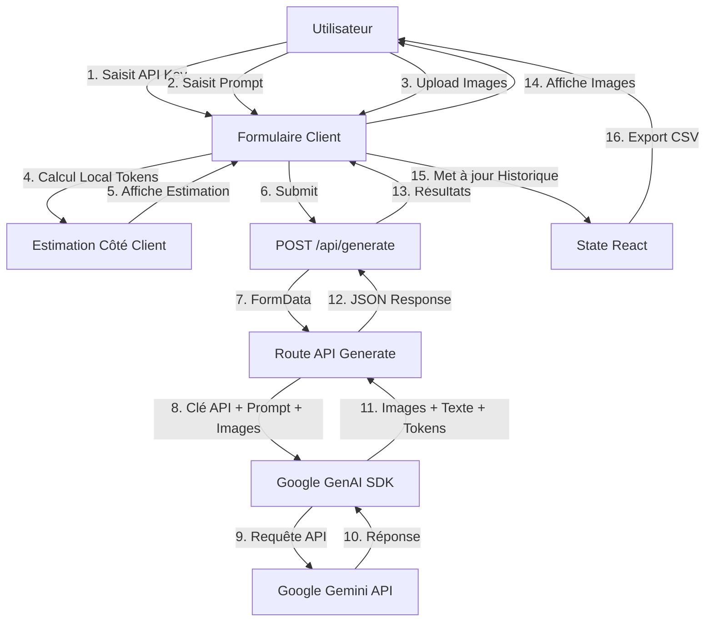
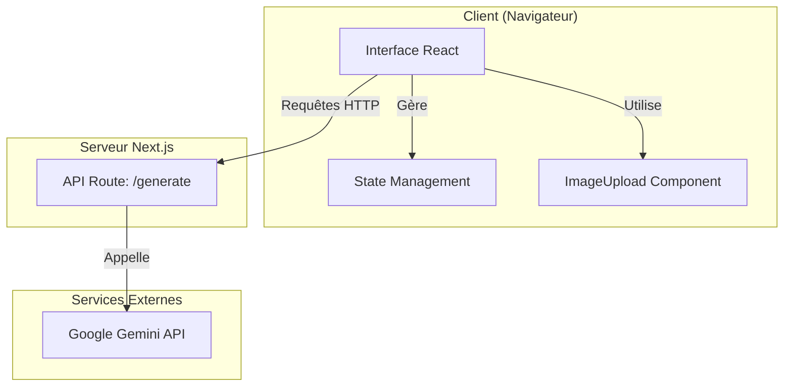

# Documentation Complète du Projet ImageGen

## Table des matières

1. [Vue d'ensemble](#vue-densemble)
2. [Stack technique](#stack-technique)
3. [Architecture du projet](#architecture-du-projet)
4. [Formulaires et interfaces](#formulaires-et-interfaces)
5. [Requêtes API](#requêtes-api)
6. [Librairies et dépendances](#librairies-et-dépendances)
7. [Fonctionnalités détaillées](#fonctionnalités-détaillées)
8. [Configuration](#configuration)
9. [Sécurité et confidentialité](#sécurité-et-confidentialité)
10. [Network Audit](NETWORK_AUDIT.md)

---

## Vue d'ensemble

### Description

**ImageGen** (également appelé **BYOK-Banana**) est une application web moderne et stateless permettant de générer des images via l'API Google Gemini. L'application offre une interface utilisateur épurée et mobile-first avec un choix de modèle : **Gemini 2.5 Flash** (par défaut), **Gemini 3 Pro Image** ou **Gemini 3.1 Flash Image (preview)**, avec estimation et facturation des coûts par modèle.

### Objectifs

- Fournir une interface simple et intuitive pour la génération d'images via Google Gemini
- Permettre aux utilisateurs d'utiliser leur propre clé API (BYOK - Bring Your Own Key)
- Offrir un suivi en temps réel des coûts et des tokens
- Maintenir une architecture stateless sans stockage de données côté serveur
- Garantir la confidentialité des utilisateurs (aucune donnée persistée)

### Philosophie BYOK (Bring Your Own Key)

Le projet suit une approche **BYOK** (Bring Your Own Key) :

- **Aucune clé API côté serveur** : La clé API est saisie directement par l'utilisateur dans l'interface
- **Pas de stockage** : La clé API n'est jamais stockée, ni côté client (localStorage) ni côté serveur
- **Stateless** : Chaque requête est indépendante, aucune session n'est maintenue
- **Transparence** : L'utilisateur a un contrôle total sur ses coûts et sa clé API

### Caractéristiques principales

- 🎨 **Génération d'images** : Création d'images à partir de prompts texte et/ou d'images en entrée
- 📊 **Suivi des coûts en temps réel** : Estimation et calcul précis des coûts pour chaque requête
- 🔢 **Comptage de tokens** : Estimation locale des tokens avant génération, valeurs réelles après
- 📈 **Historique de session** : Suivi des requêtes de la session courante avec métriques détaillées
- 📥 **Export CSV** : Export de l'historique au format CSV pour analyse
- 🖼️ **Upload d'images** : Support du drag & drop pour les images en entrée
- 📱 **Mobile-first** : Interface responsive optimisée pour tous les écrans
- 🔒 **Confidentialité** : Aucune donnée persistée, refresh = reset total

---

## Stack technique

### Framework et runtime

- **Next.js 14** (App Router)
  - Framework React avec routing basé sur le système de fichiers
  - Server Components et Client Components
  - API Routes pour les endpoints backend
  - Optimisations automatiques (code splitting, image optimization)

- **Bun** (Runtime JavaScript)
  - Runtime JavaScript ultra-rapide
  - Gestionnaire de paquets intégré
  - Alternative à Node.js avec meilleures performances

### Langages

- **TypeScript 5.0+**
  - Typage statique pour la sécurité du code
  - Configuration stricte activée
  - Support des types React et Next.js

- **React 18.2**
  - Bibliothèque UI moderne
  - Hooks (useState, useEffect, useRef, useMemo)
  - Client Components pour l'interactivité

### Styling

- **Tailwind CSS 3.4.0**
  - Framework CSS utilitaire
  - Configuration personnalisée avec thème étendu
  - Classes utilitaires pour un développement rapide
  - Responsive design intégré

- **PostCSS 8.5.6**
  - Traitement CSS avec autoprefixer
  - Intégration avec Tailwind CSS

### SDK et librairies externes

- **@google/genai 0.2.0**
  - SDK officiel Google pour l'API Gemini
  - Support des modèles de génération d'images
  - Gestion des contenus multimodaux (texte + images)

### Outils de développement

- **@types/node 20.0.0** : Types TypeScript pour Node.js
- **@types/react 18.2.0** : Types TypeScript pour React
- **@types/react-dom 18.2.0** : Types TypeScript pour React DOM
- **autoprefixer 10.4.23** : Préfixes CSS automatiques

---

## Architecture du projet

### Structure des dossiers

```
ImageGen/
├── app/                          # App Router Next.js
│   ├── api/                      # Routes API
│   │   ├── generate/
│   │   │   └── route.ts          # Endpoint génération d'images
│   │   ├── get-costs/            # (vide - non implémenté)
│   │   └── log-cost/             # (vide - non implémenté)
│   ├── expenses/                 # (dossier non utilisé)
│   ├── globals.css               # Styles globaux + animations
│   ├── layout.tsx                # Layout racine avec metadata
│   └── page.tsx                  # Page principale (interface complète)
├── components/
│   └── ImageUpload.tsx           # Composant upload drag & drop
├── public/
│   └── robots.txt                # Configuration robots.txt
├── package.json                  # Dépendances et scripts
├── tsconfig.json                 # Configuration TypeScript
├── next.config.js                # Configuration Next.js
├── tailwind.config.js            # Configuration Tailwind
├── postcss.config.js             # Configuration PostCSS
├── bun.lockb                     # Lock file Bun
└── README.md                      # Documentation utilisateur
```

### Organisation du code

#### Frontend (Client Components)

- **`app/page.tsx`** : Composant principal contenant :
  - Formulaire de génération (API key, prompt, images)
  - Affichage des résultats (images + texte)
  - Historique des coûts
  - Logique de calcul des tokens et coûts
  - Gestion de l'état local (React hooks)

- **`components/ImageUpload.tsx`** : Composant réutilisable pour :
  - Upload d'images par drag & drop
  - Sélection de fichiers
  - Prévisualisation des images
  - Gestion du nombre maximum d'images

#### Backend (API Routes)

- **`app/api/generate/route.ts`** : Endpoint POST pour :
  - Réception du prompt, clé API et images
  - Appel à l'API Google Gemini
  - Extraction des images et texte générés
  - Calcul des tokens et coûts réels
  - Retour des résultats formatés

### Flux de données



### Diagramme d'architecture



---

## Formulaires et interfaces

### Composant ImageUpload

**Fichier** : `components/ImageUpload.tsx`

**Fonctionnalités** :
- Upload d'images par **drag & drop**
- Sélection de fichiers via dialogue
- Prévisualisation des images uploadées
- Suppression individuelle d'images
- Limite de nombre d'images (configurable, défaut: 10)
- État désactivé pendant la génération

**Props** :
```typescript
interface ImageUploadProps {
  onImagesChange: (images: File[]) => void;
  maxImages?: number;  // Défaut: 10
  disabled?: boolean;  // Défaut: false
}
```

**États internes** :
- `images`: Tableau des fichiers images
- `isDragging`: État du drag & drop
- `fileInputRef`: Référence à l'input file caché

**Fonctions principales** :
- `handleDragOver`: Gère le survol lors du drag
- `handleDragLeave`: Gère la sortie de la zone de drop
- `handleDrop`: Traite les fichiers déposés
- `handleFileInput`: Traite la sélection de fichiers
- `addImages`: Ajoute des images avec vérification de la limite
- `removeImage`: Supprime une image par index
- `openFileDialog`: Ouvre le dialogue de sélection

**Validation** :
- Filtre uniquement les fichiers de type `image/*`
- Respecte la limite `maxImages`
- Vérifie la taille des fichiers

### Formulaire principal

**Fichier** : `app/page.tsx`

**Champs du formulaire** :

1. **Champ API Key** (`apiKey`)
   - Type: `password`
   - Placeholder: "AIza..."
   - Validation: Requis pour la génération
   - Lien vers Google AI Studio pour obtenir une clé

2. **Champ Prompt** (`prompt`)
   - Type: `textarea`
   - Rows: 5 (fixe, non redimensionnable)
   - Placeholder: "Describe the image you want to generate..."
   - Affichage en temps réel du nombre de tokens et coût estimé

3. **Champ Images** (`images`)
   - Composant: `ImageUpload`
   - Maximum: 10 images
   - Optionnel
   - Affichage en temps réel du nombre de tokens et coût estimé

**États du formulaire** :

```typescript
const [apiKey, setApiKey] = useState("");
const [prompt, setPrompt] = useState("");
const [images, setImages] = useState<File[]>([]);
const [loading, setLoading] = useState(false);
const [result, setResult] = useState<GenerationResult | null>(null);
const [error, setError] = useState<string | null>(null);
const [tokenEstimate, setTokenEstimate] = useState<TokenEstimate | null>(null);
const [history, setHistory] = useState<HistoryEntry[]>([]);
```

**Validation** :
- API Key requise (non vide)
- Prompt requis (non vide après trim)
- Images optionnelles (0 à 10)

**Gestion des erreurs** :
- Affichage des erreurs dans un bloc dédié
- Messages d'erreur extraits de l'API Google
- Formatage utilisateur-friendly

**Protection pendant le chargement** :
- Overlay transparent sur tout le formulaire
- Désactivation de tous les champs
- Indicateur de chargement visible
- Blocage du drag & drop

---

## Requêtes API

### Route `/api/generate`

**Méthode** : `POST`

**Endpoint** : `/api/generate`

**Fichier** : `app/api/generate/route.ts`

#### Requête

**Format** : `FormData`

**Champs** :
- `apiKey` (string, requis) : Clé API Google Gemini
- `prompt` (string, requis) : Prompt texte pour la génération
- `images` (File[], optionnel) : Images en entrée (0 à 10)

**Exemple** :
```typescript
const formData = new FormData();
formData.append("prompt", "A beautiful sunset over mountains");
formData.append("apiKey", "AIza...");
formData.append("images", imageFile1);
formData.append("images", imageFile2);
```

#### Traitement

1. **Validation** :
   - Vérification de la présence de l'API key
   - Vérification de la présence du prompt

2. **Initialisation Google GenAI** :
   ```typescript
   const ai = new GoogleGenAI({ apiKey: apiKey });
   ```

3. **Construction du contenu** :
   - Conversion des images en base64
   - Création du tableau `contents` avec images puis texte
   - Format selon la documentation Google GenAI

4. **Configuration de génération** :
   ```typescript
   const generationConfig = {
     maxOutputTokens: 32768,
     temperature: 1,
     topP: 0.95,
     responseModalities: ['TEXT', 'IMAGE'],
     imageConfig: {
       aspectRatio: '1:1',
       imageSize: '1K',
       outputMimeType: 'image/png',
     },
     safetySettings: [/* tous désactivés */]
   };
   ```

5. **Appel API** :
   ```typescript
   const response = await ai.models.generateContent({
     model: 'gemini-2.5-flash-image',
     contents: contents,
     config: generationConfig,
   });
   ```

6. **Extraction des résultats** :
   - Parcours de `response.candidates[0].content.parts`
   - Extraction du texte (`part.text`)
   - Extraction des images (`part.inlineData`)
   - Conversion des images en data URLs

7. **Calcul des tokens** :
   - `inputTokens`: `response.usageMetadata.promptTokenCount`
   - `outputTokens`: `response.usageMetadata.candidatesTokenCount` ou estimation (1290 par image)
   - `totalTokens`: `response.usageMetadata.totalTokenCount`

8. **Calcul des coûts** :
   - Input: `(inputTokens / 1_000_000) * 0.30`
   - Output: `outputImages * 0.039`
   - Total: `inputCost + outputCost`

#### Réponse

**Format** : `JSON`

**Structure** :
```typescript
{
  success: true,
  images: string[],           // Data URLs des images générées
  text: string,               // Texte généré (peut être vide)
  tokens: {
    input: number,
    output: number,
    total: number
  },
  costs: {
    input: number,            // Coût d'entrée en USD
    output: number,           // Coût de sortie en USD
    total: number            // Coût total en USD
  }
}
```

**Exemple de réponse** :
```json
{
  "success": true,
  "images": [
    "data:image/png;base64,iVBORw0KGgoAAAANS..."
  ],
  "text": "Here is the generated image...",
  "tokens": {
    "input": 1250,
    "output": 1290,
    "total": 2540
  },
  "costs": {
    "input": 0.000375,
    "output": 0.039,
    "total": 0.039375
  }
}
```

**Codes d'erreur** :
- `400` : API key ou prompt manquant
- `500` : Erreur lors de la génération

**Format d'erreur** :
```json
{
  "error": "Message d'erreur détaillé"
}
```

## Librairies et dépendances

### Dépendances principales

| Librairie | Version | Rôle |
|-----------|---------|------|
| `next` | ^14.0.0 | Framework React avec App Router |
| `react` | ^18.2.0 | Bibliothèque UI |
| `react-dom` | ^18.2.0 | Rendu React côté client |
| `@google/genai` | ^0.2.0 | SDK Google Gemini pour génération d'images |

### Dépendances de développement

| Librairie | Version | Rôle |
|-----------|---------|------|
| `typescript` | ^5.0.0 | Compilateur TypeScript |
| `@types/node` | ^20.0.0 | Types TypeScript pour Node.js |
| `@types/react` | ^18.2.0 | Types TypeScript pour React |
| `@types/react-dom` | ^18.2.0 | Types TypeScript pour React DOM |
| `tailwindcss` | 3.4.0 | Framework CSS utilitaire |
| `postcss` | ^8.5.6 | Traitement CSS |
| `autoprefixer` | ^10.4.23 | Préfixes CSS automatiques |

### Rôles détaillés

#### @google/genai

**Version** : 0.2.0

**Utilisation** :
- Initialisation du client avec la clé API
- Appel au modèle `gemini-2.5-flash-image`
- Gestion des contenus multimodaux (texte + images)
- Extraction des réponses (texte + images)

**Exemple d'utilisation** :
```typescript
import { GoogleGenAI } from '@google/genai';

const ai = new GoogleGenAI({ apiKey: apiKey });
const response = await ai.models.generateContent({
  model: 'gemini-2.5-flash-image',
  contents: contents,
  config: generationConfig,
});
```

#### Next.js

**Version** : 14.0.0

**Fonctionnalités utilisées** :
- App Router (système de routing basé sur le système de fichiers)
- API Routes (endpoints backend)
- Server Components et Client Components
- Metadata API pour le SEO
- Optimisations automatiques

#### React

**Version** : 18.2.0

**Hooks utilisés** :
- `useState` : Gestion de l'état local
- `useEffect` : Effets de bord (calcul tokens, animations)
- `useRef` : Références DOM et valeurs persistantes
- `useMemo` : Mémorisation de calculs coûteux

#### Tailwind CSS

**Version** : 3.4.0

**Fonctionnalités utilisées** :
- Classes utilitaires pour le styling
- Responsive design (sm:, lg:)
- Gradients et animations
- Configuration personnalisée avec thème étendu

---

## Fonctionnalités détaillées

### Génération d'images

**Modèles supportés** : `gemini-2.5-flash-image` (par défaut), `gemini-3-pro-image-preview`, `gemini-3.1-flash-image-preview` (preview). Le choix s'effectue via un sélecteur dans l'interface ; Gemini 3 Pro et Gemini 3.1 Flash Image sont forcés en sortie 1K (pas de 4K). Les coûts (estimation et réel) sont calculés selon le modèle sélectionné.

**Capacités** :
- Génération d'images à partir de prompts texte
- Génération d'images à partir de prompts texte + images en entrée
- Format de sortie : PNG, 1K (1024x1024px), ratio 1:1
- Génération simultanée de texte et d'images

**Processus** :
1. L'utilisateur saisit un prompt (et optionnellement des images)
2. Le formulaire envoie une requête POST à `/api/generate`
3. Le serveur convertit les images en base64
4. Appel à l'API Google Gemini avec le contenu construit
5. Extraction des images et texte de la réponse
6. Conversion des images en data URLs
7. Retour des résultats au client
8. Affichage des images et texte générés

**Limitations** :
- Une seule image générée par requête (première image de la réponse)
- Taille maximale : 1024x1024px
- Format fixe : PNG, ratio 1:1

### Comptage de tokens en temps réel

**Implémentation** : Côté client dans `app/page.tsx`

**Calcul des tokens texte** :
```typescript
function estimateTextTokens(text: string): number {
  return Math.ceil(text.length / 4); // Approximation: 1 token ≈ 4 caractères
}
```

**Calcul des tokens images** :
```typescript
function estimateImageTokens(width: number, height: number): number {
  if (width <= 384 && height <= 384) {
    return 258;
  } else {
    const thumbnails = Math.ceil((width * height) / (768 * 768));
    return thumbnails * 258;
  }
}
```

**Fonctionnalités** :
- Calcul automatique à chaque modification du prompt
- Calcul automatique à chaque ajout/suppression d'image
- Debounce de 300ms pour éviter les calculs excessifs
- Animation subtile lors des changements de valeurs
- Affichage séparé pour texte et images
- Affichage du coût estimé pour chaque type

**Affichage** :
- Badge à côté du champ prompt : tokens texte + coût
- Badge à côté du champ images : tokens images + coût
- Animation de mise en évidence lors des changements

### Calcul des coûts

La tarification dépend du modèle sélectionné. L'application applique toujours des sorties 1K (1024x1024px, ratio 1:1) pour les modèles d'images.

**Gemini 2.5 Flash Image (`gemini-2.5-flash-image`)** :

- **Input** : $0.30 par million de tokens
  - Texte : ~1 token par 4 caractères
  - Images : 258 tokens par image (≤384px) ou 258 tokens par vignette 768x768
- **Output** : $0.039 par image générée (1K)
  - Chaque image jusqu'à 1024x1024px ≈ 1 290 tokens

**Gemini 3 Pro Image (`gemini-3-pro-image-preview`)** :

- **Input** : $2.00 par million de tokens (texte + images)
- **Output** : $0.134 par image générée (1K)
- Dans l'application, ce modèle est forcé en sortie 1K, sans option 4K.

**Gemini 3.1 Flash Image (`gemini-3.1-flash-image-preview`, preview)** :

- **Input** : $0.50 par million de tokens (texte + images)
- **Output** : $0.067 par image générée (1K)
  - Dérivé de $60 par million de tokens de sortie, avec ~1 120 tokens par image 1K.

**Calcul côté client (estimation, modèle-dépendant)** :
```typescript
function calculateInputCost(inputTokens: number, modelId: ImageModelId): number {
  const pricing = getPricingForModel(modelId);
  return (inputTokens / 1_000_000) * pricing.inputPerMillion;
}

function estimateOutputCost(prompt: string, modelId: ImageModelId): number {
  const pricing = getPricingForModel(modelId);
  // Heuristique basique pour détecter le nombre d'images
  // Par défaut: 1 image = pricing.outputPerImage
}
```

**Calcul côté client (réel, après réponse de l'API)** :
```typescript
function calculateCosts(
  inputTokens: number,
  outputImages: number,
  modelId: ImageModelId
) {
  const pricing = getPricingForModel(modelId);
  const inputCost = (inputTokens / 1_000_000) * pricing.inputPerMillion;
  const outputCost = outputImages * pricing.outputPerImage;
  const totalCost = inputCost + outputCost;
  return { inputCost, outputCost, totalCost };
}
```

**Affichage** :
- Estimation avant génération (bloc dédié avec gradient)
- Coûts réels après génération (métriques détaillées)
- Formatage en USD avec 4 décimales (estimation) ou 2 décimales (arrondi)

### Historique des coûts

**Stockage** : État React local (mémoire du navigateur)

**Structure d'une entrée** :
```typescript
interface HistoryEntry {
  date: string;                    // ISO string
  prompt: string;
  costReal: number;                 // Coût réel après génération
  costEstimated: number;           // Coût estimé avant génération
  tokens: {
    input: number;
    output: number;
    total: number;
  };
  inputImages: { width: number; height: number }[] | null;
  outputImages: { width: number; height: number }[] | null;
  outputText: string | null;
}
```

**Fonctionnalités** :
- Ajout automatique après chaque génération réussie
- Affichage dans un tableau avec toutes les métriques
- Tri chronologique (plus récent en premier)
- Calcul du total de session
- Export CSV
- Copie dans le presse-papiers

**Limitations** :
- Perdu au rechargement de la page
- Stocké uniquement en mémoire
- Pas de persistance côté serveur

### Export CSV

**Format** : CSV standard avec en-têtes

**Colonnes** :
- `date` : Date et heure ISO
- `cost` : Coût réel en USD
- `input_prompt` : Prompt texte (échappé)
- `input_images` : Dimensions des images d'entrée (format: "WxH, WxH")
- `output_images` : Dimensions des images générées (format: "WxH, WxH")
- `output_text` : Texte généré (échappé)

**Fonctionnalités** :
- Téléchargement automatique du fichier
- Nom de fichier : `usage_YYYY-MM-DD.csv`
- Échappement des guillemets et virgules
- Support des caractères spéciaux

**Exemple de CSV** :
```csv
date,cost,input_prompt,input_images,output_images,output_text
2024-01-15T10:30:00.000Z,0.039375,"A beautiful sunset","1024x768","1024x1024","Here is the generated image..."
```

### Gestion de session

**Caractéristiques** :
- **Stateless** : Aucune session côté serveur
- **Client-side only** : Toute la gestion se fait côté client
- **Reset au refresh** : Rechargement de la page = perte de toutes les données
- **Pas de localStorage** : Aucune persistance locale

**Données de session** :
- Historique des coûts
- État du formulaire (perdu au refresh)
- Résultats de la dernière génération

**Recommandations** :
- Exporter régulièrement l'historique CSV
- Sauvegarder manuellement les prompts importants
- Utiliser des outils externes pour le suivi à long terme

---

## Configuration

### TypeScript (tsconfig.json)

**Configuration principale** :
```json
{
  "compilerOptions": {
    "target": "ES2020",
    "lib": ["dom", "dom.iterable", "esnext"],
    "allowJs": true,
    "skipLibCheck": true,
    "strict": true,
    "noEmit": true,
    "esModuleInterop": true,
    "module": "esnext",
    "moduleResolution": "bundler",
    "resolveJsonModule": true,
    "isolatedModules": true,
    "jsx": "preserve",
    "incremental": true,
    "paths": {
      "@/*": ["./*"]
    }
  }
}
```

**Points clés** :
- Mode strict activé
- Support JSX pour React
- Path alias `@/*` pour les imports absolus
- Target ES2020
- Module resolution "bundler" (optimisé pour Next.js)

### Next.js (next.config.js)

**Configuration** :
```javascript
{
  experimental: {
    serverActions: {
      bodySizeLimit: '10mb',
    },
  },
  async headers() {
    return [
      {
        source: '/:path*',
        headers: [
          {
            key: 'X-Robots-Tag',
            value: 'noindex, nofollow, noarchive, nosnippet, noimageindex',
          },
        ],
      },
    ];
  },
}
```

**Points clés** :
- Limite de taille pour les Server Actions : 10MB (pour les images)
- Headers de non-indexation sur toutes les routes
- Configuration minimale (Next.js 14 avec App Router)

### Tailwind CSS (tailwind.config.js)

**Configuration** :
```javascript
{
  content: [
    './pages/**/*.{js,ts,jsx,tsx,mdx}',
    './components/**/*.{js,ts,jsx,tsx,mdx}',
    './app/**/*.{js,ts,jsx,tsx,mdx}',
  ],
  theme: {
    extend: {
      colors: {
        primary: {
          DEFAULT: '#6366f1',
          hover: '#4f46e5',
          light: '#818cf8',
          dark: '#4338ca',
        },
        secondary: {
          DEFAULT: '#8b5cf6',
          hover: '#7c3aed',
        },
      },
    },
  },
}
```

**Points clés** :
- Scan de tous les fichiers React/TypeScript
- Extension du thème avec couleurs personnalisées
- Palette indigo/violet pour l'interface

### PostCSS (postcss.config.js)

**Configuration** : Utilise les plugins standards
- `tailwindcss` : Traitement Tailwind
- `autoprefixer` : Préfixes CSS automatiques

### Styles globaux (globals.css)

**Contenu** :
- Import de Tailwind CSS
- Animation marquee pour le carrousel de badges
- Styles de base personnalisés

**Animation marquee** :
```css
@keyframes marquee {
  0% { transform: translateX(0%); }
  100% { transform: translateX(-50%); }
}

.marquee-track {
  display: flex;
  flex-wrap: nowrap;
  width: max-content;
  animation: marquee 25s linear infinite;
}
```

---

## Sécurité et confidentialité

Pour une description détaillée du **Network Audit** (vérification que les requêtes partent directement vers Google et non vers votre backend, fonctionnement des requêtes, sécurité des données, affichage dans le front), voir [NETWORK_AUDIT.md](NETWORK_AUDIT.md).

### Gestion de la clé API

**Principe BYOK** :
- La clé API est **jamais stockée** côté serveur
- La clé API est **jamais stockée** côté client (pas de localStorage)
- La clé API est transmise uniquement dans la requête HTTP POST
- La clé API est utilisée uniquement pour l'appel à l'API Google Gemini
- Aucune trace de la clé API dans les logs serveur (sanitization)

**Sécurité** :
- Champ de type `password` (masqué à l'affichage)
- Transmission via HTTPS (requis en production)
- Pas de persistance (refresh = perte de la clé)
- Pas d'exposition dans l'URL (méthode POST uniquement)

**Recommandations utilisateur** :
- Ne pas partager la clé API
- Utiliser des clés API avec restrictions (domaines, quotas)
- Régénérer la clé si compromise
- Surveiller l'utilisation dans Google Cloud Console

### Non-indexation

**Configuration triple** :

1. **Metadata dans layout.tsx** :
```typescript
export const metadata: Metadata = {
  robots: {
    index: false,
    follow: false,
    nocache: true,
    googleBot: {
      index: false,
      follow: false,
      noimageindex: true,
      'max-video-preview': -1,
      'max-image-preview': 'none',
      'max-snippet': -1,
    },
  },
};
```

2. **Headers HTTP dans next.config.js** :
```javascript
headers: [
  {
    key: 'X-Robots-Tag',
    value: 'noindex, nofollow, noarchive, nosnippet, noimageindex',
  },
]
```

3. **Fichier robots.txt** :
```
User-agent: *
Disallow: /
```

**Résultat** : Le site n'est pas indexé par les moteurs de recherche.

### Stateless architecture

**Caractéristiques** :
- **Aucune base de données** : Pas de stockage persistant
- **Aucun fichier serveur** : Pas de sauvegarde de données
- **Aucune session serveur** : Chaque requête est indépendante
- **State client uniquement** : Toute la gestion se fait côté navigateur

**Avantages** :
- Confidentialité maximale
- Pas de coûts de stockage
- Simplicité de déploiement
- Conformité RGPD (pas de données personnelles stockées)

**Inconvénients** :
- Perte de données au refresh
- Pas d'historique entre sessions
- Pas de sauvegarde automatique

### Sanitization des logs

**Fichier** : `app/api/generate/route.ts`

**Fonctionnalités** :
- Troncature des données base64 dans les logs
- Masquage des données sensibles
- Logs détaillés pour le debugging sans exposer les données

**Exemple** :
```typescript
function truncateBase64ForLog(data: string, maxLength: number = 50): string {
  if (!data || data.length <= maxLength) return data;
  return data.substring(0, maxLength) + '...[' + (data.length - maxLength) + ' more chars]';
}
```

### Recommandations de déploiement

**Environnement de production** :
- Utiliser HTTPS obligatoire
- Configurer les variables d'environnement si nécessaire
- Activer les headers de sécurité (CSP, HSTS)
- Surveiller les logs pour détecter les abus
- Limiter le rate limiting si nécessaire

**Sécurité des images** :
- Validation du type MIME côté serveur
- Limitation de la taille des fichiers
- Pas de stockage des images uploadées
- Traitement en mémoire uniquement

---

## Conclusion

Ce document fournit une vue complète du projet ImageGen, couvrant tous les aspects techniques, fonctionnels et de sécurité. Le projet suit une architecture moderne, stateless et respectueuse de la confidentialité, offrant une interface simple pour la génération d'images via Google Gemini.

Pour toute question ou contribution, référez-vous au README.md pour les instructions d'installation et d'utilisation.

