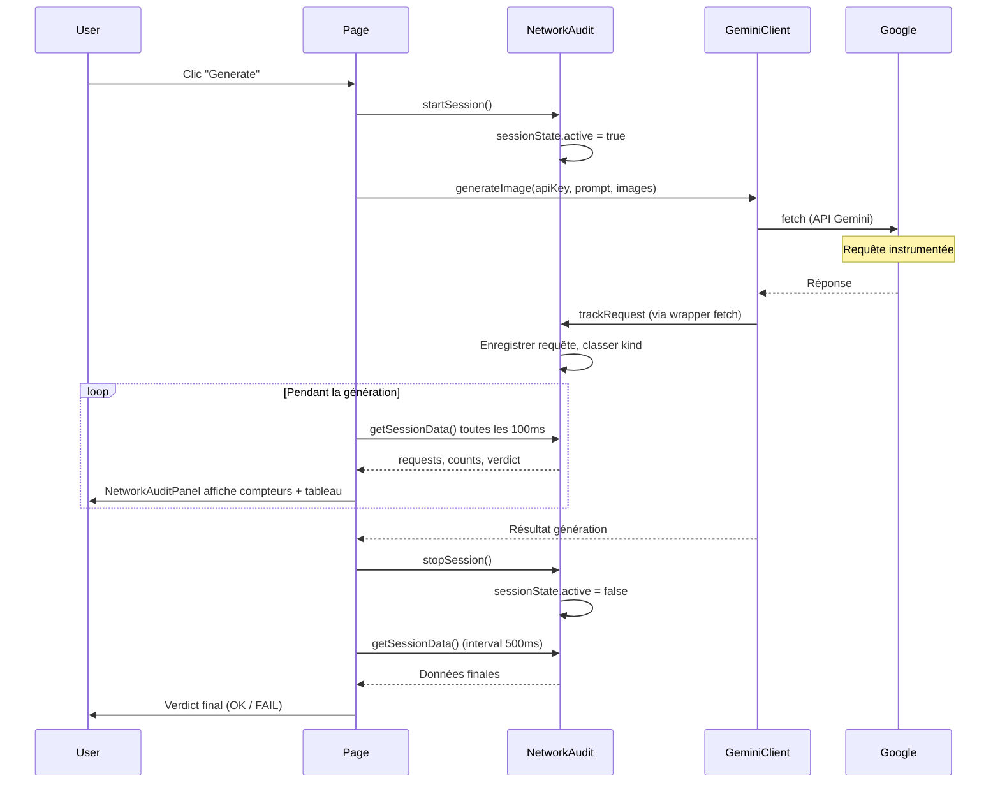

# Documentation détaillée du Network Audit

Ce document décrit le mécanisme **Network Audit** de l'application ImageGen (BYOK-Banana) : son objectif, le fonctionnement des requêtes, la classification, le verdict, les aspects sécurité et confidentialité, et ce qui est affiché dans l'interface.

---

## Table des matières

1. [Objectif du Network Audit](#1-objectif-du-network-audit)
2. [Fonctionnement des requêtes (instrumentation)](#2-fonctionnement-des-requêtes-instrumentation)
3. [Classification des requêtes (kind)](#3-classification-des-requêtes-kind)
4. [Verdict et données exposées par le module](#4-verdict-et-données-exposées-par-le-module)
5. [Sécurité et confidentialité](#5-sécurité-et-confidentialité)
6. [Ce qui est affiché dans le front (NetworkAuditPanel)](#6-ce-qui-est-affiché-dans-le-front-networkauditpanel)
7. [Schéma récapitulatif](#7-schéma-récapitulatif)

---

## 1. Objectif du Network Audit

Le **Network Audit** est un mécanisme côté client qui :

- **Vérifie** que pendant une génération d'image, les requêtes HTTP partent **directement vers Google** (domaines tels que `googleapis.com`, etc.) et **pas vers le domaine de l'application** (requêtes dites « ours »).
- **Affiche un verdict** : **OK** si aucune requête ne passe par votre backend pendant la session, **FAIL** sinon.

Il sert à confirmer que l'appel à l'API Gemini se fait bien **depuis le navigateur directement vers Google**, et non via un proxy ou une API intermédiaire hébergée sur votre domaine. Cela garantit :

- **Modèle BYOK** : la clé API et les données (prompt, images) ne transitent qu'entre le navigateur et Google ; aucun serveur intermédiaire ne les voit.
- **Pas de proxy** : aucune requête ne doit être envoyée vers votre propre domaine pendant la génération.
- **Transparence** : l'utilisateur peut voir en temps réel quelles requêtes ont été effectuées et s'assurer qu'aucune ne part vers votre backend.

---

## 2. Fonctionnement des requêtes (instrumentation)

### Quand l'instrumentation a lieu

Au **chargement du module** `networkAudit` côté client (dès qu'un composant qui l'importe est exécuté), les fonctions `instrumentFetch()` et `instrumentXMLHttpRequest()` sont exécutées **une seule fois**. L'instrumentation ne s'applique qu'en environnement navigateur (`typeof window !== 'undefined'`).

### Comment les requêtes sont interceptées

**Fetch**

- `globalThis.fetch` est remplacé par un wrapper qui :
  - enregistre l'heure de début ;
  - appelle le **vrai** `fetch` avec les mêmes arguments ;
  - à la fin (succès ou erreur), calcule la durée et appelle `trackRequest(method, url, status, durationMs)` ;
  - en cas d'erreur réseau, `status` est passé à `null`.

**XMLHttpRequest**

- Le constructeur `window.XMLHttpRequest` est remplacé par un wrapper qui :
  - intercepte `open(method, url, ...)` pour mémoriser la méthode et l'URL ;
  - intercepte `send()` et attache des listeners `load` et `error` (une seule fois) ;
  - au `load` ou `error`, calcule la durée et appelle `trackRequest(method, url, status, durationMs)` (avec `xhr.status` ou `null` en cas d'erreur).

### Condition d'enregistrement

Seules les requêtes effectuées pendant une **session active** sont enregistrées. Dans `trackRequest`, si `sessionState.active` est `false`, la fonction retourne immédiatement sans rien enregistrer. En dehors d'une session, toutes les requêtes (navigateur, autres onglets, etc.) sont ignorées par l'audit.

### Cycle de vie de la session

- **Début** : `startSession()` est appelé au **début** de `handleGenerate` dans [app/page.tsx](app/page.tsx), juste avant l'appel à `generateImage()`.
- **Fin** : `stopSession()` est appelé dans le bloc `finally` du même `handleGenerate`, après la génération (succès ou erreur). La session est donc active uniquement pendant l'exécution d'une génération.

### Flux résumé

1. L'utilisateur clique sur « Generate ».
2. `startSession()` active l'enregistrement.
3. `generateImage()` est exécuté (client) : le SDK Google GenAI utilise `fetch` pour appeler l'API Gemini.
4. Chaque requête HTTP (notamment vers `googleapis.com`) est interceptée par le wrapper et enregistrée via `trackRequest`.
5. À la fin (succès ou erreur), `stopSession()` désactive l'enregistrement.

Pendant ce flux, si tout est conforme au modèle BYOK, seules des requêtes vers des domaines Google devraient apparaître ; aucune requête vers le host de la page (requêtes « ours »).

---

## 3. Classification des requêtes (kind)

Chaque requête enregistrée est classée en trois catégories (**kind**) à partir de l'URL :

- **Ours** : le hostname de l'URL est **égal** à `window.location.host` (même origine que la page). Toute requête vers votre propre domaine est donc « ours ».
- **Google** : le hostname **se termine** par l'un des domaines suivants :
  - `googleapis.com`
  - `google.com`
  - `gstatic.com`
  - `googleusercontent.com`
- **Other** : tout autre hostname (ni ours, ni Google).

L'extraction du hostname se fait via `new URL(url).hostname`. En cas d'échec du parsing (URL invalide), un fallback avec une regex `^https?:\/\/([^\/]+)` est utilisé pour extraire le hostname.

L'ordre de test dans le code est : d'abord « ours », puis « google », sinon « other ».

---

## 4. Verdict et données exposées par le module

### Verdict

- **OK** : aucune requête « ours » n'a été enregistrée pendant la session (`counts.ours === 0`).
- **FAIL** : au moins une requête « ours » a été enregistrée (`counts.ours > 0`).

Le verdict est calculé dans `getSessionData()` à partir des requêtes actuelles et des compteurs.

### Données retournées par `getSessionData()`

La fonction retourne un objet avec :

- **requests** : liste des requêtes enregistrées, dans l'ordre **inverse** (les plus récentes en premier). Le module ne conserve que les **10 dernières** requêtes (slice des 10 dernières à chaque nouvel enregistrement).
- **counts** : `{ google, ours, other }` — nombre de requêtes par kind.
- **verdict** : `'OK'` ou `'FAIL'` comme ci-dessus.

Chaque élément de `requests` contient :

- **ts** : timestamp (Date.now()) au moment de l'enregistrement.
- **method** : méthode HTTP (GET, POST, etc.).
- **url** : URL complète de la requête.
- **hostname** : hostname extrait de l'URL.
- **status** : code HTTP de la réponse, ou `null` en cas d'erreur réseau (fetch rejeté ou XHR en erreur).
- **durationMs** : durée de la requête en millisecondes.
- **kind** : `'google' | 'ours' | 'other'`.

---

## 5. Sécurité et confidentialité

### Côté client uniquement

Tout le code d'audit s'exécute **dans le navigateur**. Aucune donnée d'audit (requêtes, compteurs, verdict) n'est envoyée à un serveur. Le Network Audit est uniquement un outil de transparence local.

### Données enregistrées

Seules des **métadonnées** sont enregistrées :

- URL, méthode HTTP, code de statut, durée.
- **Aucun** enregistrement du body des requêtes ou des réponses.
- **Aucun** enregistrement des headers (donc pas de clé API, pas d'Authorization, etc.).
- Pas de contenu du prompt ni des images dans les données d'audit.

La clé API et les contenus sensibles ne sont donc pas stockés ni exposés par le mécanisme d'audit.

### Stockage

- L'état (session + liste des requêtes) est conservé **en mémoire** dans une variable de module (`sessionState`).
- Aucun **localStorage**, **sessionStorage** ou **cookie** n'est utilisé pour l'audit.
- Un **rechargement de la page** réinitialise tout : nouvelle session, liste vide, instrumentation réappliquée au chargement du module.

### Affichage dans l'interface

Dans le panneau Network Audit, la seule donnée potentiellement « sensible » est l'URL. Pour limiter l'exposition :

- Le front n'affiche que le **hostname** (et non l'URL complète).
- Le hostname est **tronqué à 30 caractères** + « … » si plus long.
- Les query params et le path ne sont **pas** affichés dans l'UI.

L'URL complète reste toutefois en mémoire le temps de la session (dans `sessionState.requests`) ; elle n'est jamais envoyée à un serveur.

### Limites

- Toute librairie ou extension qui **modifie** `fetch` ou `XMLHttpRequest` **après** le chargement du module peut ne pas être instrumentée (ou peut contourner les wrappers).
- Les requêtes effectuées dans des **Web Workers** ou d'autres contextes (iframe avec origine différente, etc.) ne sont pas interceptées par ce mécanisme, qui ne wrap que le `fetch` et le `XMLHttpRequest` du contexte principal de la page.

---

## 6. Ce qui est affiché dans le front (NetworkAuditPanel)

Le composant [components/NetworkAuditPanel.tsx](components/NetworkAuditPanel.tsx) affiche les données fournies par `getSessionData()`.

### Emplacement

- Panneau **« Network Audit »** en haut de la page d'accueil, **au-dessus** du formulaire de génération.
- Le panneau est **repliable** : un bouton permet d'afficher ou masquer le contenu (icônes ▲ / ▼).

### Compteurs (4 blocs)

- **Google** : nombre de requêtes classées `google`.
- **Ours** : nombre de requêtes classées `ours`.
- **Other** : nombre de requêtes classées `other`.
- **Verdict** : **OK** (fond vert, bordure verte) ou **FAIL** (fond rouge, bordure rouge).

### Tableau « Last N Requests »

- **N** : au plus 10 (les dernières requêtes enregistrées).
- Colonnes :
  - **Hostname** : hostname de l'URL, tronqué à 30 caractères + « … » si plus long (police monospace).
  - **Method** : méthode HTTP (GET, POST, etc.).
  - **Status** : code HTTP ou « — » si `null` (erreur réseau). Couleurs : vert (2xx), orange (4xx), rouge (5xx), gris (null ou autres).
  - **Duration** : durée en `ms` si &lt; 1000 ms, sinon en secondes avec 2 décimales (ex. `1.23s`).
  - **Kind** : badge coloré — bleu pour `google`, rouge pour `ours`, gris pour `other`.

### Rafraîchissement des données

- **Pendant la session active** : `getSessionData()` est appelé toutes les **100 ms** (setInterval) pour mettre à jour les compteurs et le tableau en temps réel.
- **Quand la session est inactive** : un autre intervalle (500 ms) appelle `getSessionData()` pour mettre à jour l'affichage après `stopSession()` (par exemple pour afficher le verdict final et la liste figée).

### État vide

S'il n'y a **aucune requête** enregistrée, un message s'affiche à la place du tableau :

- « No requests tracked yet. Start a generation to see network activity. »

---

## 7. Schéma récapitulatif

En résumé : l'utilisateur lance une génération, la session d'audit s'ouvre, toutes les requêtes HTTP (notamment vers Google) sont interceptées et enregistrées, le panneau affiche en temps réel les compteurs et les dernières requêtes, puis la session se ferme et le verdict final (OK si aucune requête « ours », FAIL sinon) reste affiché.

---

## 8. Résumé des changements (audit inattaquable)

- **Modèle de données** : `NetworkRequest` remplacé par `NetworkEvent` (ts, channel, hostname, method?, status?, durationMs?, kind). Aucune URL, header, body ou paramètre sensible n’est jamais logué.
- **Canaux instrumentés** : fetch, XMLHttpRequest, navigator.sendBeacon, WebSocket (open), EventSource (construction), HTMLImageElement.src, HTMLScriptElement.src, HTMLLinkElement.href. Instrumentation idempotente (`__networkAuditPatched`).
- **Session** : startSession enregistre tsStart, originHost, buildInfo (NEXT_PUBLIC_VERCEL_GIT_COMMIT_SHA si dispo). stopSession enregistre tsEnd et calcule sessionHash = SHA-256 des events redacted (format canonique).
- **Verdict** : mode STRICT (OK ssi ours === 0 et other === 0) et LENIENT (OK si ours === 0, WARN si other > 0). Toggle Strict/Lenient dans le panneau.
- **Preuve** : getProofPayload(), getProofAsCopyableText(), getProofAsBlob() pour Copy proof et Download JSON (données redacted uniquement).
- **UI** : bloc « Why this is safe », compteurs + verdict OK/FAIL/WARN, 20 derniers events avec ts relatif et channel, blocs « Verify it yourself (DevTools) » et « Limits », boutons Copy proof, Download JSON, Copy verification steps.

---

## 9. Instructions de test manuel

1. Lancer l’app (`npm run dev`), ouvrir la page.
2. Vérifier que le panneau Network Audit affiche « Why this is safe » (ouvert), compteurs à 0, Verdict OK, et les blocs DevTools / Limits (fermés).
3. Basculer le mode en Lenient, puis Strict ; le verdict reste OK tant qu’aucune génération n’a eu lieu.
4. Saisir une clé API et un prompt, cliquer « Generate ». Pendant la génération : compteurs mis à jour (Google > 0), tableau des events avec channel fetch, hostname *googleapis.com, kind google. Verdict OK (Strict ou Lenient selon other).
5. Après génération : cliquer « Copy proof » puis coller dans un éditeur — vérifier présence de tsStart, tsEnd, originHost, counts, verdict, events (sans URL complète), sessionHash.
6. Cliquer « Download JSON » — vérifier que le fichier téléchargé contient le même payload (redacted).
7. Ouvrir « Verify it yourself (DevTools) », cliquer « Copy verification steps » — vérifier que les étapes et l’host actuel sont copiés.
8. Ouvrir DevTools > Network, Preserve log, filtrer Fetch/XHR, relancer une génération : vérifier que les requêtes visibles vont vers *googleapis.com et aucune vers le host de la page.
9. (Optionnel) En Strict, si une requête « other » existait, le verdict devrait être FAIL ; en Lenient, il devrait être WARN.
